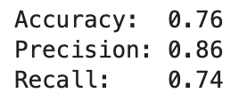

How to Train a Classification Model with TensorFlow in 10 Minutes 
=================================================================


#### From data gathering and preparation to model training and evaluation --- Source code included 

Deep learning is everywhere. From sales forecasting to segmenting skin
diseases on image data --- there's nothing deep learning algorithms
can't do, given quality data.

If deep learning and TensorFlow are new to you, you're in the right
place. This lab will show you the entire process of building a
classification model on tabular data. You'll go from data gathering and
preparation to training and evaluating neural network models in just one
sitting. Let's start.

You'll need TensorFlow 2+, Numpy, Pandas, Matplotlib, and Scikit-Learn
installed to follow along.

------------------------------------------------------------------------

Dataset used
------------
### Task 1: Google Collab Our Coding Tool:

Open google Collab open and be ready! 

1. Open Google Collab - https://colab.research.google.com/

2. Click on file and select "New Notebook in Drive" option ( It might ask you to sign in with a acccount)

3. Then, you will be directed to a new notebook , were we will perform our tasks!

Data preparation and exploration
--------------------------------
### Task 2: Dataset exploration and preparation


Let us keep things simple today and stick with a well-known **Wine Quality** dataset

**Question 1:**
Load the dataset from the given URL and display a random sample of 5 rows.

**Solution:**

Use the below link to read the file in google collab. 

Use the dataset link - https://raw.githubusercontent.com/Neha-Chiluka/deeplearning/refs/heads/main/tensorflow/data/data.csv

You can use the following code in the first cell .

``` import numpy as np
import pandas as pd

df = pd.read_csv('https://raw.githubusercontent.com/Neha-Chiluka/deeplearning/refs/heads/main/tensorflow/data/winequalityN.csv')
df.sample(5)
```

**After you enter the code click on shift and enter to run the code or you can click on the play button**.

Here's how the dataset looks like after you run the code.


It's mostly clean, but there's still some work to do.

### Basic preparation

The dataset has some missing values, but the number isn't significant,
as there are 6497 rows in total:


Run the following code to get rid of them:

    df = df.dropna()

The only non-numerical feature is `type`. It can be either *white* (4870
rows) or *red* (1593) rows. The following snippet converts this feature
to a binary one called `is_white_wine`, where the value is 1 if `type`
is *white* and 0 otherwise:

``` {.language-python}
df['is_white_wine'] = [
    1 if typ == 'white' else 0 for typ in df['type']]
df.drop('type', axis=1, inplace=True)
```

All features are numeric now, and there's only one thing left to
do --- make the target variable (`quality`) binary.

### Converting to a binary classification problem

The wines are graded from 3 to 9, assuming higher is better. Here are
the value counts:


To keep things extra simple, we'll convert it into a binary variable.
We'll classify any wine with a grade of 6 and above as *good* (1), and
all other wines as *bad* (0). Here's the code:

``` {.language-python}
df['is_good_wine'] = [
    1 if quality >= 6 else 0 for quality in df['quality']
]
df.drop('quality', axis=1, inplace=True)

df.head()
```

And here's how the dataset looks like now:


You now have 4091 good wines and 2372 bad wines. The classes are
imbalanced, but we can work with that. Let's split the dataset into
training and testing sets next.

### Train/test split

We'll stick to a standard 80:20 split. Here's the code:

``` {.language-python}
from sklearn.model_selection import train_test_split


X = df.drop('is_good_wine', axis=1)
y = df['is_good_wine']

X_train, X_test, y_train, y_test = train_test_split(
    X, y, 
    test_size=0.2, random_state=42
)
```

You now have 5170 rows in the training set and 1293 rows in the testing
set. It should be enough to train a somewhat decent neural network
model. Let's scale the data before we start the training.

### Data scaling

Features like `sulphates` and `citric acid` have values close to zero,
while `total sulfur dioxide` is in hundreds. You'll confuse the neural
network if you leave them as such, as it will think a feature on a
higher scale is more important.

That's where scaling comes into play. We'll use `StandardScaler` from
Scikit-Learn to fit and transform the training data and to apply the
transformation to the testing data:

``` {.language-python}
from sklearn.preprocessing import StandardScaler


scaler = StandardScaler()
X_train_scaled = scaler.fit_transform(X_train)
X_test_scaled = scaler.transform(X_test)
```

Here's how the first three scaled rows look like:


The value range is much tighter now, so a neural network should do a
better job. Let's train the model and see if we can get something
decent.

Training a classification model with TensorFlow
-----------------------------------------------

You'll need to keep a couple of things in mind when training a binary
classification model:

-   **Output layer structure** --- You'll want to have one neuron
    activated with a sigmoid function. This will output a probability
    you can then assign to either a good wine (P \> 0.5) or a bad wine
    (P \<= 0.5).
-   **Loss function** --- Binary cross-entropy is the one to go with.
    Don't mistake it for categorical cross-entropy.
-   **Class balance** --- Are the classes in the target variable
    balanced? In other words, do you have roughly the same number of
    good and bad wines? If not, *accuracy* might not be the best
    evaluation metric. We'll also use *precision* and *recall*.

Let's define a neural network architecture next, having the above three
points in mind.

### Defining a neural network architecture

I've chosen this architecture entirely at random, so feel free to adjust
it. The model goes from 12 input features to the first hidden layer of
128 neurons, followed by two additional hidden layers of 256 neurons.
There's a 1-neuron output layer at the end. Hidden layers use ReLU as
the activation function, and the output layer uses Sigmoid.

Here's the code:

``` {.language-python}
import tensorflow as tf
tf.random.set_seed(42)


model = tf.keras.Sequential([
    tf.keras.layers.Dense(128, activation='relu'),
    tf.keras.layers.Dense(256, activation='relu'),
    tf.keras.layers.Dense(256, activation='relu'),
    tf.keras.layers.Dense(1, activation='sigmoid')
])

model.compile(
    loss=tf.keras.losses.binary_crossentropy,
    optimizer=tf.keras.optimizers.Adam(lr=0.03),
    metrics=[
        tf.keras.metrics.BinaryAccuracy(name='accuracy'),
        tf.keras.metrics.Precision(name='precision'),
        tf.keras.metrics.Recall(name='recall')
    ]
)

history = model.fit(X_train_scaled, y_train, epochs=100)
```

This will initiate the training process. A single epoch takes around 1
second on my machine (M1 MBP):


We kept track of loss, accuracy, precision, and recall during training,
and saved them to `history`. We can now visualize these metrics to get a
sense of how the model is doing.

### Visualizing model performance

Let's start by importing Matplotlib and tweaking the default styles a
bit. The following code snippet will make the plot larger and remove the
top and right spines:

``` {.language-python}
import matplotlib.pyplot as plt
from matplotlib import rcParams
rcParams['figure.figsize'] = (18, 8)
rcParams['axes.spines.top'] = False
rcParams['axes.spines.right'] = False
```

The plot will have multiple lines --- for loss, accuracy, precision, and
recall. They all share the X-axis, which represents the epoch number
(`np.arange(1, 101)`). We should see loss decreasing, and every other
metric increasing:

``` {.language-python}
plt.plot(
    np.arange(1, 101), 
    history.history['loss'], label='Loss'
)
plt.plot(
    np.arange(1, 101), 
    history.history['accuracy'], label='Accuracy'
)
plt.plot(
    np.arange(1, 101), 
    history.history['precision'], label='Precision'
)
plt.plot(
    np.arange(1, 101), 
    history.history['recall'], label='Recall'
)
plt.title('Evaluation metrics', size=20)
plt.xlabel('Epoch', size=14)
plt.legend();
```

Let's take a look:


Accuracy, precision, and recall increase slightly as we train the model,
while loss decreases. All have occasional spikes, which would hopefully
wear off if you were to train the model longer.

According to the chart, you could train the model for more epochs, as
there's no sign of plateau.

But are we overfitting? Let's answer that next.

#### Making predictions

You can now use the `predict()` function to get prediction probabilities
on the scaled test data:

    predictions = model.predict(X_test_scaled)

Here's how they look like:


You'll have to convert them to classes before evaluation. The logic is
simple --- if the probability is greater than 0.5 we assign 1 (good
wine), and 0 (bad wine) otherwise:

``` {.language-python}
prediction_classes = [
    1 if prob > 0.5 else 0 for prob in np.ravel(predictions)
]
```

Here's how the first 20 look like:


That's all we need --- let's evaluate the model next.

### Model evaluation on test data

Let's start with the confusion matrix:

``` {.language-python}
from sklearn.metrics import confusion_matrix

print(confusion_matrix(y_test, prediction_classes))
```


There are more false negatives (214) than false positives (99), so the
recall value on the test set will be lower than precision.

The following snippet prints accuracy, precision, and recall on the test
set:

``` {.language-python}
from sklearn.metrics import accuracy_score, precision_score, recall_score


print(f'Accuracy: {accuracy_score(y_test, prediction_classes):.2f}')
print(f'Precision: {precision_score(y_test, prediction_classes):.2f}')
print(f'Recall: {recall_score(y_test, prediction_classes):.2f}')
```



All values are somewhat lower when compared to train set evaluation:

-   **Accuracy**: 0.82
-   **Precision**: 0.88
-   **Recall**: 0.83

The model is overfitting slightly, but it's still decent work for a
couple of minutes. We'll go over the optimization in the following
lab.

------------------------------------------------------------------------

Parting words
-------------

And that does it --- you now know how to train a simple neural network
for binary classification. The dataset we used today was relatively
clean, and required almost zero preparation work. Don't get used to that
feeling.

There's a lot we can improve. For example, you could add additional
layers to the network, increase the number of neurons, choose different
activation functions, select a different optimizer, add dropout layers,
and much more. The possibilities are almost endless, so it all boils
down to experimentation.

The following lab will cover optimization --- you'll learn how to
find the optimal learning rate and neural network architecture
automatically.
