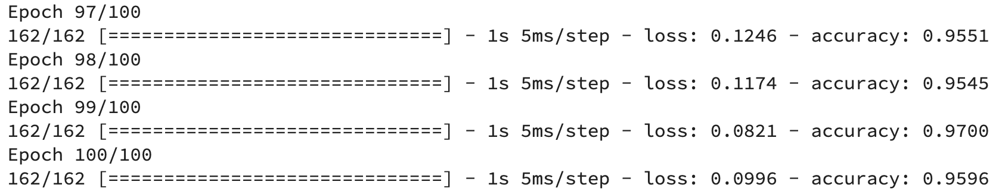

Lab 3 - How to Optimize Learning Rate with TensorFlow --- It's Easier Than You Think (Wine Quality Dataset)
============================================================================


#### Significantly improving your models doesn't take much time --- Here's how to get started 

Tuning neural network models is no joke. There are so many
hyperparameters to tune, and tuning all of them at once using a grid
search approach could take weeks, even months. *Learning rate* is a
hyperparameter you can tune in a couple of minutes, provided you know
how. This lab will teach you how.

The learning rate controls how much the weights are updated according to
the estimated error. Choose too small of a value and your model will
train forever and likely get stuck. Opt for a too large learning rate
and your model might *skip* the optimal set of weights during training.

You'll need TensorFlow 2+, Numpy, Pandas, Matplotlib, and Scikit-Learn
installed to follow along.


------------------------------------------------------------------------
### Task 2 -  Import and Preview the Wine Quality Dataset

In this task, you will import the wine quality dataset and preview a random sample of the data.

Questions:

1. Import necessary libraries (os, numpy, pandas, and warnings).
Set environment variables to suppress TensorFlow logs and warnings.

2. Load the dataset into a DataFrame using pd.read_csv().

3. Print a random sample of 5 rows from the dataset using the sample() method to get an idea of how the data looks.

Solution:

I don't plan to spend much time here. We'll use the same dataset as in
the [previous lab] --- the
[wine quality dataset](https://www.kaggle.com/shelvigarg/wine-quality-dataset) from
Kaggle:


You can use the following code to import it to Python and print a random
couple of rows:

``` {.language-python}
import os
import numpy as np
import pandas as pd
import warnings
os.environ['TF_CPP_MIN_LOG_LEVEL'] = '2' 
warnings.filterwarnings('ignore')

df = pd.read_csv('data/winequalityN.csv')
df.sample(5)
```

We're ignoring the warnings and changing the default TensorFlow log
level just so we don't get overwhelmed with the output.

Here's how the dataset looks like:


### Task 3: Data Preprocessing for Binary Classification

In this task, you will preprocess the wine quality dataset to prepare it for binary classification. The dataset is initially rated on a scale, but we will convert it into a binary classification problem where wines are classified as "good" or "bad."

1. Drop rows with missing values from the dataset since there are only a few missing values and we won't use imputation.

2. The type column indicates whether a wine is white or red. You need to convert this categorical feature into a binary feature (is_white_wine), where:

3. The quality column contains the wine rating on a scale from 3 to 9. You need to:

- Declare wines with a quality of 6 or higher as "good" (1)
- Declare wines with a quality lower than 6 as "bad" (0)
- Drop the quality column after conversion.

4. Train/Test Split: Split the dataset into training and testing sets using an 80:20 ratio. The target variable will be is_good_wine, and the remaining features will be used for the input.

5. Use the StandardScaler to scale the features so that they are on the same scale. This is important because features like total sulfur dioxide and citric acid have different value ranges.

**Solution:**

The dataset is mostly clean, but isn't designed for binary
classification by default (good/bad wine). Instead, the wines are rated
on a scale. We'll address that now, with a bunch of other things:

Here's the entire data preprocessing code snippet:

``` {.language-python}
from sklearn.model_selection import train_test_split
from sklearn.preprocessing import StandardScaler


# Prepare the data
df = df.dropna()
df['is_white_wine'] = [
    1 if typ == 'white' else 0 for typ in df['type']
]
df['is_good_wine'] = [
    1 if quality >= 6 else 0 for quality in df['quality']
]
df.drop(['type', 'quality'], axis=1, inplace=True)

# Train/test split
X = df.drop('is_good_wine', axis=1)
y = df['is_good_wine']
X_train, X_test, y_train, y_test = train_test_split(
    X, y, 
    test_size=0.2, random_state=42
)

# Scaling
scaler = StandardScaler()
X_train_scaled = scaler.fit_transform(X_train)
X_test_scaled = scaler.transform(X_test)
```

And here's how the first couple of scaled rows look like:


With that out of the way, let's see how to optimize the learning rate.

How to optimize learning rate in TensorFlow
-------------------------------------------
### Task 4 - Optimizing the Learning Rate

In this task, you will explore how to optimize the learning rate in a model training process using TensorFlow.

**Question:**

1. Import the TensorFlow library and set the random seed to 42 to ensure reproducibility of results.

**Solution:**

Let us start by importing TensorFlow and setting the seed so you can
reproduce the results:

``` {.language-python}
import tensorflow as tf
tf.random.set_seed(42)
```

### Task 5 - Define and Train a Neural Network Model with Learning Rate Scheduler

In this task, you will define a neural network model using TensorFlow, compile it, and train it with a learning rate schedule.

**Questions-**

1. Create a sequential model using tf.keras.Sequential().
- Add the following layers to the model:
- A Dense layer with 128 units and ReLU activation function.
- A Dense layer with 256 units and ReLU activation function.
- A second Dense layer with 256 units and ReLU activation function.
- A final Dense layer with 1 unit and Sigmoid activation function (since this is a binary classification task).

2. Compile the model with binary_crossentropy as the loss function, Adam as the optimizer, and BinaryAccuracy as the evaluation metric.


3. Use the LearningRateScheduler callback to adjust the learning rate during training.

4. Define a lambda function to change the learning rate every epoch. 


5. Train the model using the .fit() method, specifying the following parameters:

- X_train_scaled: the scaled training data (input features).
- y_train: the training labels (target values).
- Set epochs=100 to run the training for 100 epochs.
- Include the LearningRateScheduler callback to adjust the learning rate as specified.

6. Use the .history attribute to access and analyze the loss and accuracy values for each epoch, and optionally plot these metrics to visualize training performance.

**Solution**

Next, let's define a neural network model architecture, compile the
model, and train it. The only new thing here is the
`LearningRateScheduler`. It allows us to enter the above-declared way to
change the learning rate as a lambda function.

Here's the entire code:

``` {.language-python}
initial_model = tf.keras.Sequential([
    tf.keras.layers.Dense(128, activation='relu'),
    tf.keras.layers.Dense(256, activation='relu'),
    tf.keras.layers.Dense(256, activation='relu'),
    tf.keras.layers.Dense(1, activation='sigmoid')
])

initial_model.compile(
    loss=tf.keras.losses.binary_crossentropy,
    optimizer=tf.keras.optimizers.Adam(),
    metrics=[
        tf.keras.metrics.BinaryAccuracy(name='accuracy')
    ]
)

initial_history = initial_model.fit(
    X_train_scaled,
    y_train,
    epochs=100,
    callbacks=[
        tf.keras.callbacks.LearningRateScheduler(
            lambda epoch: 1e-3 * 10 ** (epoch / 30)
        )
    ]
)
```
### Task 6 - Visualize Training Metrics: Loss, Accuracy, and Learning Rate

In this task, you will plot the training loss, accuracy, and learning rate for the initial_model over the 100 epochs.

**Questions:**

1. After training the model for 100 epochs, the initial_history object contains the loss, accuracy, and learning rate for each epoch.

- Use matplotlib to plot the following metrics:

- Loss: Shows how the model's error evolves over time.

- Accuracy: Tracks how the model's accuracy changes during training.

- Learning Rate: Displays the exponential adjustment in learning rate as specified by the LearningRateScheduler.

**Solution:**

Set the plot title as 'Evaluation Metrics' and adjust the font size.
Label the x-axis as 'Epoch' and set the font size for the label.
Add a legend to the plot to differentiate between loss, accuracy, and learning rate.
Display the Plot

After plotting the data, use plt.legend() to show the labels for each line (Loss, Accuracy, and Learning Rate).
Display the plot to visualize the training process and how the loss, accuracy, and learning rate evolve over time.
The training will start now and you'll see a decent accuracy
immediately --- around 75% --- but it will drop after 50-something
epochs because the learning rate became too large. After 100 epochs, the
`initial_model` had around 60% accuracy:


The `initial_history` variable now has information on loss, accuracy,
and learning rate. Let's plot all of them:

``` {.language-python}
import matplotlib.pyplot as plt
from matplotlib import rcParams
rcParams['figure.figsize'] = (18, 8)
rcParams['axes.spines.top'] = False
rcParams['axes.spines.right'] = False 

plt.plot(
    np.arange(1, 101), 
    initial_history.history['loss'], 
    label='Loss', lw=3
)
plt.plot(
    np.arange(1, 101), 
    initial_history.history['accuracy'], 
    label='Accuracy', lw=3
)
plt.plot(
    np.arange(1, 101), 
    initial_history.history['lr'], 
    label='Learning rate', color='#000', lw=3, linestyle='--'
)
plt.title('Evaluation metrics', size=20)
plt.xlabel('Epoch', size=14)
plt.legend();
```

Here's the chart:


## Plot Loss vs. Learning Rate
### Task 7 - Analyze Learning Rate vs. Loss

**Question:**

Define learning rates: learning_rates = 1e-3 * (10 ** (np.arange(100) / 30)).
Use plt.semilogx() to plot loss vs. learning rate on a logarithmic scale.


1. Identify the learning rate with the minimum loss and minimal volatility.
2. Determine Optimal Learning Rate
4. Choose the learning rate around 0.007, where loss is lowest and stable.
5. Compare with Default Learning Rate

7. Train the model with the optimal learning rate and compare the performance to the default rate.

**Solution:**

The accuracy dipped significantly around epoch 50 and flattened for a
while, before starting to dip further. The exact opposite happened to
loss, which makes sense.

You can now plot the loss against learning rate on a logarithmic scale
to eyeball where the minimum loss was achieved:

``` {.language-python}
learning_rates = 1e-3 * (10 ** (np.arange(100) / 30))
plt.semilogx(
    learning_rates, 
    initial_history.history['loss'], 
    lw=3, color='#000'
)
plt.title('Learning rate vs. loss', size=20)
plt.xlabel('Learning rate', size=14)
plt.ylabel('Loss', size=14);
```

Here's the chart:


Train a model with optimal learning rate
----------------------------------------
### Task 8 - Train a Model with Optimal Learning Rate

Define & Compile the Model

1. Create a neural network with the following layers:
- Dense layer (128 units, ReLU)
- Dense layer (256 units, ReLU)
- Dense layer (256 units, ReLU)
- Output layer (1 unit, Sigmoid)
- Use binary_crossentropy for the loss function.
- Set the optimizer to Adam with a learning rate of 0.007.
- Set the evaluation metric to BinaryAccuracy.
- Train the Model

2. Train the model for 100 epochs using X_train_scaled and y_train.

**Solution:**

With a learning rate of 0.007 in mind, let's write another neural
network model. You won't need the LearningRateScheduler this time:

``` {.language-python}
model_optimized = tf.keras.Sequential([
    tf.keras.layers.Dense(128, activation='relu'),
    tf.keras.layers.Dense(256, activation='relu'),
    tf.keras.layers.Dense(256, activation='relu'),
    tf.keras.layers.Dense(1, activation='sigmoid')
])

model_optimized.compile(
    loss=tf.keras.losses.binary_crossentropy,
    optimizer=tf.keras.optimizers.Adam(learning_rate=0.007),
    metrics=[
        tf.keras.metrics.BinaryAccuracy(name='accuracy')
    ]
)

history_optimized = model_optimized.fit(
    X_train_scaled,
    y_train,
    epochs=100
)
```

We got 76% accuracy with the default learning rate in the previous lab,
so it'll be interesting to see if learning rate optimization can
increase it. The reported accuracy on the train set looks too good to be
true, so it's likely our model is overfitting:




## Visualize Accuracy vs. Loss

### Task 9 - Monitor Training Progress (Accuracy vs. Loss)

#### Questions:

1. Use matplotlib to plot the loss and accuracy for each epoch during training.
2. Plot the Loss and Accuracy
3. Assess whether the model might be overfitting based on the accuracy and loss curves.

#### Solution:

It won't matter too much if we've managed to increase the performance on
the test set, but you could save yourself some time by training the
model for fewer epochs.

Here's how the accuracy vs. loss looks like for the optimized model:

``` {.language-python}
plt.plot(
    np.arange(1, 101), 
    history_optimized.history['loss'], 
    label='Loss', lw=3
)
plt.plot(
    np.arange(1, 101), 
    history_optimized.history['accuracy'], 
    label='Accuracy', lw=3
)
plt.title('Accuracy vs. Loss per epoch', size=20)
plt.xlabel('Epoch', size=14)
plt.legend()
```


### Make Predictions on the Test Set

### Task 10 - Evaluate Model Predictions on the Test Set

Questions:

1. Use the trained model to predict outcomes for the test set
2. Convert the predicted probabilities to binary classes (0 or 1) based on a threshold of 0.5
3. Use accuracy_score() from sklearn.metrics to calculate the accuracy of the model on the test set:
4. Use confusion_matrix() from sklearn.metrics to display the confusion matrix

Solution:


Let's finally calculate the predictions and evaluate them against the
test set. Here's the code:

``` {.language-python}
from sklearn.metrics import confusion_matrix
from sklearn.metrics import accuracy_score

predictions = model_optimized.predict(X_test_scaled)
prediction_classes = [1 if prob > 0.5 else 0 for prob in np.ravel(predictions)]


print(f'Accuracy on the test set: 
    {accuracy_score(y_test, prediction_classes):.2f}')
print()
print('Confusion matrix:')
print(confusion_matrix(y_test, prediction_classes))
```

And here's the output:


