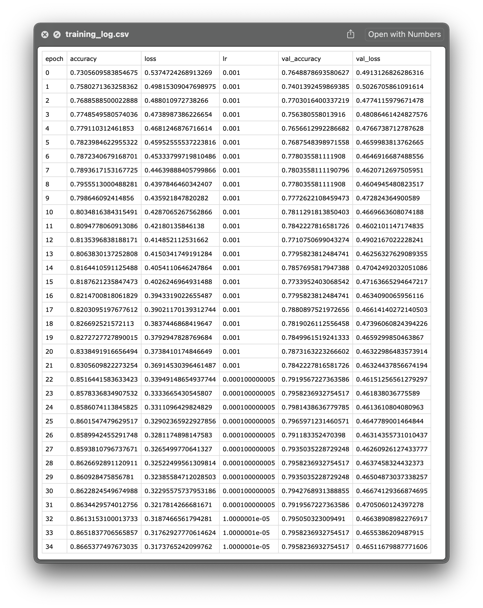

TensorFlow Callbacks --- How to Monitor Neural Network Training Like a Pro 
==========================================================================


#### Top 4 TensorFlow callbacks to implement in your next deep learning project

Training deep learning models can take days or weeks, but how long is
long enough? Your model likely won't be learning after some point, and
continuing the training session costs you both time and money.

Picture this --- you're training a large image recognition model for
many epochs, and hope to get a usable model. After a couple of dozens of
epochs, the loss isn't decreasing, and the accuracy isn't increasing.
Training for longer without tweaking the parameters first is, you've
guessed it, a waste of time.

Thankfully, there's a solution, and it's built into TensorFlow API. It's
named *callbacks* and represents special functions executed **during**
model training. You can use them to save models, save training logs,
reduce the learning rate if the model is stuck, and much more.


You can download the source code on
[GitHub](https://github.com/fenago/deeplearning/tree/main/tensorflow).

------------------------------------------------------------------------

Dataset used and data preprocessing
-----------------------------------

I don't plan to spend much dealing with data today. We'll use the same
dataset as in the previous labs --- the [wine quality
dataset](https://www.kaggle.com/shelvigarg/wine-quality-dataset) from
Kaggle:


You can use the following code to import it to Python and print a random
couple of rows:

``` {.language-python}
import os
import numpy as np
import pandas as pd
import warnings
os.environ['TF_CPP_MIN_LOG_LEVEL'] = '2' 
warnings.filterwarnings('ignore')

df = pd.read_csv('data/winequalityN.csv')
df.sample(5)
```

We're ignoring the warnings and changing the default TensorFlow log
level just so we don't get overwhelmed with the output.

Here's how the dataset looks like:


The dataset is mostly clean, but isn't designed for binary
classification by default (good/bad wine). Instead, the wines are rated
on a scale. We'll address that now, with numerous other things:

-   **Delete missing values** --- There's only a handful of them, so we
    won't waste time on imputation.
-   **Handle categorical features** --- The only one is `type`,
    indicating whether the wine is white or red.
-   **Convert to a binary classification task** --- We'll declare any
    wine with a grade of 6 and above as *good*, and anything below as
    *bad*.
-   **Train/test split** --- A classic 80:20 split.
-   **Scale the data** --- The scale between predictors differs
    significantly, so we'll use the `StandardScaler` to bring the values
    closer.

Here's the entire data preprocessing code snippet:

``` {.language-python}
from sklearn.model_selection import train_test_split
from sklearn.preprocessing import StandardScaler

# Prepare the data
df = df.dropna()
df['is_white_wine'] = [1 if typ == 'white' else 0 for typ in df['type']]
df['is_good_wine'] = [1 if quality >= 6 else 0 for quality in df['quality']]
df.drop(['type', 'quality'], axis=1, inplace=True)

# Train/test split
X = df.drop('is_good_wine', axis=1)
y = df['is_good_wine']
X_train, X_test, y_train, y_test = train_test_split(
    X, y, 
    test_size=0.2, random_state=42
)

# Scaling
scaler = StandardScaler()
X_train_scaled = scaler.fit_transform(X_train)
X_test_scaled = scaler.transform(X_test)
```

With that out of the way, let's see how to approach declaring callbacks
in TensorFlow.

### Declaring callbacks with TensorFlow

If you've read my previous lab on [optimizing the learning rate with TensorFlow],
you already know how callbacks work. Basically, you'll include them in
the `fit()` function. There's no one stopping you from declaring a list
of callbacks beforehand, just to keep the training function extra clean.

TensorFlow has a bunch of callbacks built-in. You can also write custom
callback functions, but that's a topic for another time. I use only four
built-in callbacks for most projects.

### ModelCheckpoint

You can use this one to save the model locally on the current epoch if
it beats the performance obtained on the previous one. The performance
with any metric you want, such as loss, or accuracy. I recommend
monitoring the performance on the validation set, as deep learning
models tend to overfit the training data.

You can save the model either as a checkpoint folder or as an `hdf5`
file. I recommend the latter, as it looks much cleaner on your file
system. Also, you can specify a much nicer file path that contains the
epoch number and the value of the evaluation metric at that epoch.

Here's how to declare `ModelCheckpoint` callback:

``` {.language-python}
cb_checkpoint = tf.keras.callbacks.ModelCheckpoint(
    filepath='checkpoints/model-{epoch:02d}-{val_accuracy:.2f}.hdf5',
    monitor='val_accuracy',
    mode='max',
    save_best_only=True,
    verbose=1
)
```

In a nutshell, it will save the model on the current epoch only if it
outperforms the one at the previous epoch, regarding the accuracy on the
validation set.

### ReduceLROnPlateau

If a value of the evaluation metric doesn't change for several epochs,
`ReduceLROnPlateau` reduces the learning rate. For example, if
validation loss didn't decrease for 10 epochs, this callback tells
TensorFlow to reduce the learning rate.

The new learning rate is calculated as the old learning rate multiplied
by a user-defined factor. So, if the old learning rate is 0.01, and the
factor is 0.1, the new learning rate is 0.01 \* 0.1 = 0.001.

Here's how to declare it:

``` {.language-python}
cb_reducelr = tf.keras.callbacks.ReduceLROnPlateau(
    monitor='val_loss',
    mode='min',
    factor=0.1,
    patience=10,
    verbose=1,
    min_lr=0.00001
)
```

To summarize, the above declaration instructs TensorFlow to reduce the
learning rate by a factor of 0.1 if the validation loss didn't decrease
in the last 10 epochs. The learning rate will never go below 0.00001.

### EarlyStopping

If a metric doesn't change by a minimum delta in a given number of
epochs, the `EarlyStopping` callback kills the training process. For
example, if validation accuracy doesn't increase at least 0.001 in 10
epochs, this callback tells TensorFlow to stop the training.

Here's how to declare it:

``` {.language-python}
cb_earlystop = tf.keras.callbacks.EarlyStopping(
    monitor='val_accuracy',
    mode='max',
    min_delta=0.001,
    patience=10,
    verbose=1
)
```

There's not much to it --- it's simple but extremely useful.

### CSVLogger

The `CSVLogger` callback captures model training history and dumps it
into a CSV file. It's useful for analyzing the performance later, and
comparing multiple models. It saves data for all the metrics you're
tracking, such as loss, accuracy, precision, recall --- both for
training and validation sets.

Here's how to declare it:

``` {.language-python}
cb_csvlogger = tf.keras.callbacks.CSVLogger(
    filename='training_log.csv',
    separator=',',
    append=False
)
```

Easy, right? Definitely, but the best is yet to come. Let's train the
model with these callbacks next.

Training a model with TensorFlow callbacks
------------------------------------------

It's a common practice in deep learning to split the dataset into
training, validation, and test set. We did a two-way split, so for
simplicity's sake, we'll treat the test set as a validation set.

We'll train the model for 1000 epochs --- a lot, but the `EarlyStopping`
callback will kill the training process way before. You can specify the
callbacks as a list inside the `fit()` function. Here's the code:

``` {.language-python}
model = tf.keras.Sequential([
    tf.keras.layers.Dense(64, activation='relu'),
    tf.keras.layers.Dense(64, activation='relu'),
    tf.keras.layers.Dense(64, activation='relu'),
    tf.keras.layers.Dense(1, activation='sigmoid')
])

model.compile(
    loss=tf.keras.losses.binary_crossentropy,
    optimizer=tf.keras.optimizers.Adam(),
    metrics=[tf.keras.metrics.BinaryAccuracy(name='accuracy')]
)

model.fit(
    X_train_scaled, 
    y_train, 
    epochs=1000,
    validation_data=(X_test_scaled, y_test),
    callbacks=[cb_checkpoint, cb_reducelr, cb_earlystop, cb_csvlogger]
)
```

The model training will start now, and you'll see something similar
printed out:


The output is a bit more detailed than before, due to callbacks. You can
see the `ModelCheckpoint` callback doing its job, and saving the model
after the first epoch. The `hdf5` file name tells you what validation
accuracy was achieved at which epoch.

The `EarlyStopping` callback will kill the training process around epoch
35:


And that's it --- why waste time training for 965 epochs more if the
model is already stuck here. It's maybe not a huge time saver for simple
tabular models, but imagine training for hours or days unnecessarily on
rented GPU machines.

Yours `checkpoints/` folder should look similar to mine after the
training finishes:


You should always choose the one with the highest epoch number for
further tweaks or evaluation. Don't let the accuracy of 0.80 on the last
two models confuse you --- it's only rounded to two decimal places.

You can load the best model with TensorFlow's `load_model()` function:

``` {.language-python}
best_model = tf.keras.models.load_model('checkpoints/model-25-0.80.hdf5')
```

And you can proceed with predictions and evaluations as you usually
would --- no need to cover that today.

If you wonder about the contents of the `training_log.csv`, here's how
it looks on my machine:



You can see how both loss and accuracy were tracked on training and
validation sets, and how learning rate decreased over time thanks to the
`ReduceLROnPlateau` callback. In short --- everything works as
advertised.

That's all I wanted to cover today. Let's wrap things up next.

------------------------------------------------------------------------

Parting words
-------------

Training deep learning models doesn't have to take so long. Pay
attention to your evaluation metrics, and stop the training if the model
isn't learning. You don't have to do that manually, of course, as there
are built-in callback functions. You've learned four of them today, and
for the rest, please visit the [official
documentation.](https://www.tensorflow.org/api_docs/python/tf/keras/callbacks)

Stay tuned if you want to learn more about custom callbacks, and also
stay tuned for the upcoming convolutional neural network labs. I'll
cover everything you need to know to get hired as a machine learning
engineer.
