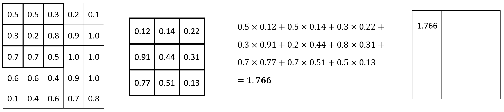
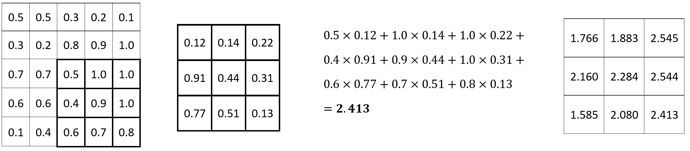
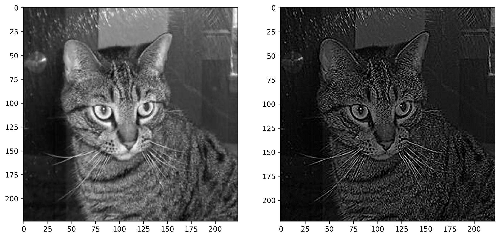

TensorFlow for Computer Vision --- How to Implement Convolutions From Scratch in Python
=======================================================================================


#### You'll need 10 minutes to implement convolutions with padding in Numpy

Convolutional networks are fun. You saw [last
week]
how they improve model performance when compared to vanilla artificial
neural networks. But what a convolution actually does to an image?
That's what you'll learn today.

After reading, you'll know how to write your convolution function from
scratch with Numpy. You'll apply filters such as blurring, sharpening,
and outlining to images, and you'll also learn the role of *padding* in
convolutional layers.

It's a lot of work, and we're doing everything from scratch. Let's dive
in.


You can download the source code on
[GitHub](https://github.com/fenago/deeplearning/tree/main/tensorflow).

------------------------------------------------------------------------

How Convolutions Work
---------------------

Convolutional neural networks are a special type of neural network used
for image classification. At the heart of any convolutional neural
network lies convolution, an operation highly specialized at detecting
patterns in images.

Convolutional layers require you to specify the number of filters
(kernels). Think of these as a number of pattern detectors. Early
convolutional layers detect basic patterns, such as edges, corners, and
so on. Specialized patterns are detected at later convolutional layers,
such as dog ears or cat paws, depending on the dataset.

A single filter is just a small matrix (usually rectangular). It's your
task to decide on the number of rows and columns, but 3x3 or 5x5 are
good starting points. Values inside the filter matrix are initialized
randomly. The task of a neural network is to learn the optimal values
for the filter matrix, given your specific dataset.

Let's take a look at a convolution operation in action. We have a 5x5
image and a 3x3 filter. The filter slides (convolves) over every 3x3 set
of pixels in the image, and calculates an element-wise multiplication.
The multiplication results are then summed:



The process is repeated for every set of 3x3 pixels. Here's the
calculation for the following set:


It goes on and on until the final set of 3x3 pixels is reached:



And that's a convolution in a nutshell! Convolutional layers are useful
for finding the optimal filter matrices, but a convolution in itself
only applies the filter to the image. There's a ton of well-known filter
matrices for different image operations, such as blurring and
sharpening. Let's see how to work with them next.

Dataset and Image Loading
-------------------------

We'll use the [Dogs vs. Cats
dataset](https://www.kaggle.com/pybear/cats-vs-dogs?select=PetImages)
from Kaggle for the rest of the lab. It's licensed under the
Creative Commons License, which means you can use it for free. 

That's not a requirement, since you can apply convolution to any image.
Seriously, download any image from the web, it will serve you just fine
for today.

Let's get the library imports out of the way. You'll need Numpy for the
math, and PIL and Matplotlib to display images:

``` {.language-python}
import numpy as np
from PIL import Image, ImageOps
import matplotlib.pyplot as plt
```

From here, let's also declare two functions for displaying images. The
first one plots a single image, and the second one plots two of them
side by side (1 row, 2 columns):

``` {.language-python}
def plot_image(img: np.array):
    plt.figure(figsize=(6, 6))
    plt.imshow(img, cmap='gray');
    
def plot_two_images(img1: np.array, img2: np.array):
    _, ax = plt.subplots(1, 2, figsize=(12, 6))
    ax[0].imshow(img1, cmap='gray')
    ax[1].imshow(img2, cmap='gray');
```

You can now load and display an image. For simplicity, we'll grayscale
it and resize it to 224x224. None of these transformations are
mandatory, but they make our job a bit easier, as there's only one color
channel to apply convolution to:

``` {.language-python}
img = Image.open('data/train/cat/1.jpg')
img = ImageOps.grayscale(img)
img = img.resize(size=(224, 224))
plot_image(img=img)
```


And that takes care of the boring stuff. We'll apply all convolutional
filters to the image above. But first, let's declare a couple of filter
matrices.

Declare Filters for Convolutions
--------------------------------

The task of a convolutional layer in a neural network is to find N
filters that best extract features from the images. Did you know there
are known filters for doing different image operations?

Well, there are --- such as a filter for sharpening, blurring, and
outlining. I've copied the filter matrix values from the [setosa.io
website](https://setosa.io/ev/image-kernels/), and I strongly recommend
you to check it out for a deeper dive.

Anyhow, all mentioned filters are nothing but 3x3 matrices. Copy the
following code to store them to variables:

``` {.language-python}
sharpen = np.array([
    [0, -1, 0],
    [-1, 5, -1],
    [0, -1, 0]
])

blur = np.array([
    [0.0625, 0.125, 0.0625],
    [0.125,  0.25,  0.125],
    [0.0625, 0.125, 0.0625]
])

outline = np.array([
    [-1, -1, -1],
    [-1,  8, -1],
    [-1, -1, -1]
])
```

Simple, right? That's all there is to individual filters. Let's write a
convolution from scratch next and apply these to our image.

Implement Convolution From Scratch
----------------------------------

Applying a convolution to an image will make it smaller (assuming no
padding). How much smaller depends on the filter size. All of ours are
3x3, but you can go larger.

Sliding, or convolving a 3x3 filter over images means we'll lose a
single pixel on all sides (2 in total). For example, sliding a 3x3
filter over a 224x224 image results in a 222x222 image. Likewise,
sliding a 5x5 filter over the same image results in a 220x220 image.

We'll declare a helper function to calculate the image size after
applying the convolution. It's nothing fancy, but will make our lives a
bit easier. It basically calculates how many *windows* of the filter
size you can fit to an image (assuming square image):

``` {.language-python}
def calculate_target_size(img_size: int, kernel_size: int) -> int:
    num_pixels = 0
    
    # From 0 up to img size (if img size = 224, then up to 223)
    for i in range(img_size):
        # Add the kernel size (let's say 3) to the current i
        added = i + kernel_size
        # It must be lower than the image size
        if added <= img_size:
            # Increment if so
            num_pixels += 1
            
    return num_pixels
```

Here's a result from a couple of tests:

-   Image size: 224, filter size: 3
-   Image size: 224, filter size: 5


Works as advertised. Let's work on a convolution function next. Here's
what a 3x3 filter does to a single 3x3 image subset:

1.  Extracts it to a separate matrix
2.  Does an element-wise multiplication between the image subset and the
    filter
3.  Sums the results

Here's an implementation in code for a single 3x3 pixel subset:


That was easy, but how can you apply the logic to an entire image? Well,
easily. The `convolve()` function calculates the target size and creates
a matrix of zeros with that shape, iterates over all rows and columns of
the image matrix, subsets it, and applies the convolution. Sounds like a
lot when put in a single sentence, but the code shouldn't give you too
much headache:

``` {.language-python}
def convolve(img: np.array, kernel: np.array) -> np.array:
    # Assuming a rectangular image
    tgt_size = calculate_target_size(
        img_size=img.shape[0],
        kernel_size=kernel.shape[0]
    )
    # To simplify things
    k = kernel.shape[0]
    
    # 2D array of zeros
    convolved_img = np.zeros(shape=(tgt_size, tgt_size))
    
    # Iterate over the rows
    for i in range(tgt_size):
        # Iterate over the columns
        for j in range(tgt_size):
            # img[i, j] = individual pixel value
            # Get the current matrix
            mat = img[i:i+k, j:j+k]
            
            # Apply the convolution - element-wise multiplication and summation of the result
            # Store the result to i-th row and j-th column of our convolved_img array
            convolved_img[i, j] = np.sum(np.multiply(mat, kernel))
            
    return convolved_img
```

Let's test the thing. The following snippet applies the **sharpening**
filter to our image:

``` {.language-python}
img_sharpened = convolve(img=np.array(img), kernel=sharpen)
img_sharpened
```


You can use the `plot_two_images()` function to visualize our cat image
before and after the transformation:

``` {.language-python}
plot_two_images(
    img1=img, 
    img2=img_sharpened
)
```


The colors are a bit off since values in the right image don't range
between 0 and 255. It's not a big issue, but you can "fix" it by
replacing all negative values with zeros:

``` {.language-python}
def negative_to_zero(img: np.array) -> np.array:
    img = img.copy()
    img[img < 0] = 0
    return img

plot_two_images(
    img1=img, 
    img2=negative_to_zero(img=img_sharpened)
)
```



The image on the right definitely looks sharpened, no arguing there.
Let's see what **blurring** does next:

``` {.language-python}
img_blurred = convolve(img=np.array(img), kernel=blur)
plot_two_images(
    img1=img, 
    img2=img_blurred
)
```


The blurring filter matrix doesn't have negative values, so the coloring
is identical. Once again, there's no debate --- the blurring filter
worked as advertised.

Finally, let's see what the **outline** filter will do to our image:

``` {.language-python}
img_outlined = convolve(img=np.array(img), kernel=outline)
plot_two_images(
    img1=img, 
    img2=img_outlined
)
```


It also suffers from the coloring problem, as values in the matrix are
mostly negative. Use `negative_to_zero()` to get a clearer idea:

``` {.language-python}
plot_two_images(
    img1=img, 
    img2=negative_to_zero(img=img_outlined)
)
```


You know what the only problem is? The convolved images are of shape
222x222 pixels. What if you want to keep the original size of 224x224
pixels? That's where padding comes into play.

Implement Convolution with Padding From Scratch
-----------------------------------------------

TensorFlow's `Conv2D` layer lets you specify either `valid` or `same`
for the `padding` parameter. The first one (default) adds no padding
before applying the convolution operation. It's basically what we've
covered in the previous section.

The second one adds padding depending on the filter size, so the source
and convolved images are of the same shape.

Padding is essentially a "black" border around the image. It's black
because the values are zeros, and zeros represent the color black. The
black borders don't have any side effects on the calculations, as it's
just a multiplication with zero.

Let's get an intuitive understanding of the concept before writing any
code. The following image shows you what happens to image X as the
filter K is applied to it. Basically, it goes from 5x5 to 3x3 (Y):


Adding a pixel-wide padding results in an input image (X) of 7x7 pixels,
and the resulting image (Y) of 5x5 pixels:


The Y in the second image has the same number of pixels as X in the
first image, which is exactly what we want. Convolution operation has to
*take* some pixels from the image, and it's better for these to be
zeros.

In the real world, pixels on the edges usually don't contain significant
patterns, so losing them isn't the worst thing in the world.

Onto the code now. First things first, let's declare a function that
returns the number of pixels we need to pad the image with on a single
side, depending on the kernel size. It's just an integer division with
2:

``` {.language-python}
def get_padding_width_per_side(kernel_size: int) -> int:
    # Simple integer division
    return kernel_size // 2
```

Here are a couple of examples for kernel sizes 3 and 5:


There isn't much to it. We'll now write a function that adds padding to
the image. First, the function declares a matrix of zeros with a shape
of `image.shape + padding * 2`. We're multiplying the padding with 2
because we need it on all sides. The function then indexes the matrix so
the padding is ignored and changes the zeros with the actual image
values:

``` {.language-python}
def add_padding_to_image(img: np.array, padding_width: int) -> np.array:
    # Array of zeros of shape (img + padding_width)
    img_with_padding = np.zeros(shape=(
        img.shape[0] + padding_width * 2,  # Multiply with two because we need padding on all sides
        img.shape[1] + padding_width * 2
    ))
    
    # Change the inner elements
    # For example, if img.shape = (224, 224), and img_with_padding.shape = (226, 226)
    # keep the pixel wide padding on all sides, but change the other values to be the same as img
    img_with_padding[padding_width:-padding_width, padding_width:-padding_width] = img
    
    return img_with_padding
```

Let's test it by adding a padding to the image for a 3x3 filter:

``` {.language-python}
img_with_padding_3x3 = add_padding_to_image(
    img=np.array(img), 
    padding_width=pad_3x3
)

print(img_with_padding_3x3.shape)
plot_image(img_with_padding_3x3)
```


You can see the black border if you zoom in close enough. If you're
wondering, this image has a shape of 226x226 pixels. Here's how it looks
like when displayed as a matrix:

``` {.language-python}
img_with_padding_3x3
```


You can see the original image surrounded with zeros, which is what we
wanted. Let's see if the same holds true for the 5x5 kernel:

``` {.language-python}
img_with_padding_5x5 = add_padding_to_image(
    img=np.array(img), 
    padding_width=pad_5x5
)

print(img_with_padding_5x5.shape)
plot_image(img_with_padding_5x5)
```


Now you can definitely see the black border on this 228x228 image. Let's
see how it looks when printed as a matrix:

``` {.language-python}
img_with_padding_5x5
```


It looks how it should --- two pixel padding on all sides. Let's apply a
sharpening filter to our single-pixel-padded image to see if there are
any issues:

``` {.language-python}
img_padded_3x3_sharpened = convolve(img=img_with_padding_3x3, kernel=sharpen)
print(img_padded_3x3_sharpened.shape)

plot_two_images(
    img1=img, 
    img2=img_padded_3x3_sharpened
)
```


Works without any issues. The convolved image has a shape of 224x224
pixels, which is exactly what we wanted.

And that's convolutions and padding in a nutshell. We covered a lot
today, so let's make a short recap next.

------------------------------------------------------------------------

Conclusion
----------

Convolutions are easier than they sound. The whole thing boils down to
sliding a filter across an entire image. If you drop all the matrix
terminology, it simplifies to elementary school math --- multiplication
and addition. There's nothing fancy going on.

We could complicate things further by introducing **strides** --- but
these are common to both convolutions and pooling. I'll leave them for
the following lab, which covers pooling --- a downsizing operation
that commonly follows a convolutional layer.

