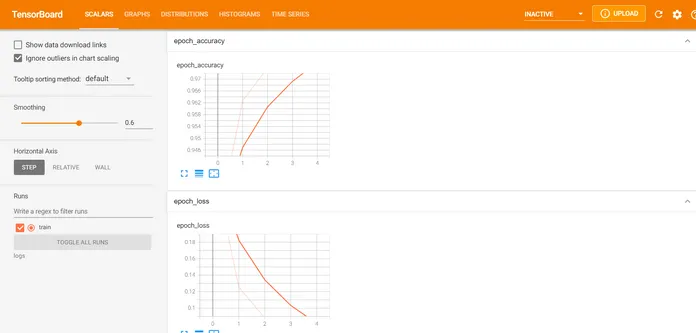
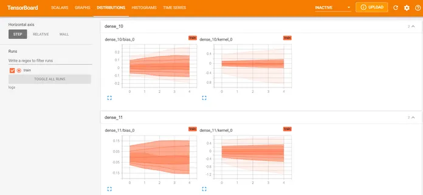
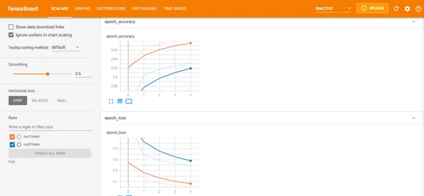

TensorBoard Tutorial in Keras for Beginner
==========================================

[Introduction]
-----------------------------

In this lab, we will go through the tutorial for TensorBoard which
is a visualization tool to understand various metrics of your [neural
network](https://machinelearningknowledge.ai/glossary/artificial-neural-network/){.glossaryLink
.cmtt_Deep .Learning} model and the training process. We will first
explain what is TensorBoard and how to install it. Then, we will show
you an example of how to use Tensorboard using Keras and go through
various visualizations.

[**What is TensorBoard?**]
------------------------------------------------

TensorBoard is a visualization web app to get a better understanding of
various parameters of the neural network model and its training metrics.
Such visualizations are quite useful when you are doing experiments with
neural network models and want to keep a close watch on the related
metrics. It is open-source and is a part of the Tensorflow
group.[]{#ezoic-pub-ad-placeholder-133
.ezoic-adpicker-ad}[[]{#div-gpt-ad-machinelearningknowledge_ai-box-3-0
.ezoic-ad ezaw="468" ezah="60"
style="position: relative; z-index: 0; display: inline-block; padding: 0px; min-height: 60px; min-width: 468px;"}]{.ezoic-ad
.box-3 .box-3133 .adtester-container .adtester-container-133
ez-name="machinelearningknowledge_ai-box-3" style=""}

Some of the [useful](https://www.tensorflow.org/tensorboard) things you
can do with TensorBoard includes --

-   Visualize metrics like accuracy and loss.
-   Visualize model graph.
-   Visualize histograms for weights and biases to understand how they
    change during training.
-   Visualize data like text, image, and audio.
-   Visualize embeddings in lower dimension space.

[**TensorBoard Tutorial (Keras)**]
---------------------------------------------------------------

Here we are going to use a small project to create a neural network in
Keras for Tensorboard Tutorial. For this, we are going to use the famous
MNIST handwritten digit recognition dataset.

Since this is a TensorBoard tutorial, we will not explain much about the
data preprocessing and neural network building process. To understand
more details about working with MNIST handwritten digit dataset you can
check below tutorial --

-   **Also Read --** [[Tensorflow.js Tutorial with MNIST Handwritten
    Digit
    Dataset](https://machinelearningknowledge.ai/tensorflow-js-tutorial-with-mnist-handwritten-digit-dataset-example/)]{style="color:#00f"}

### i) Install TensorBoard

You can install TensorBoard by using pip as shown below --

    pip install tensorboard

### ii) Starting TensorBoard

The first thing we need to do is start the TensorBoard service. To do
this you need to run below in the command prompt. --logdir parameter
signifies the directory where data will be saved to visualize
TensorBoard. Here we have given the directory name as 'logs'.

     tensorboard --logdir logs

This will start the TensorBoard service at the default port 6066 as
shown below. The TesnorBoard dashboard can be accessed as
http://localhost:6006/

Output:

    Serving TensorBoard on localhost; to expose to the network, use a proxy or pass --bind_all
    TensorBoard 2.5.0 at http://localhost:6006/ (Press CTRL+C to quit)

In Jupyer notebook, you can issue the following command in the cell

    %tensorboard --logdir logs

### iii) Loading Libraries

We will quickly import the required libraries for our example. (Do note
these libraries have nothing to do with TensorBoard but are needed for
building the neural network of our example.)

    import tensorflow as tf
    from tensorflow import keras
    import matplotlib.pyplot as plt
    %matplotlib inline
    import numpy as np

### iv) Loading MNIST Dataset

Now we will load the MNIST dataset that comes as part of the Keras
package. Let us also quickly visualize one sample data after loading the
dataset.

    (X_train, y_train) , (X_test, y_test) = keras.datasets.mnist.load_data()
    plt.matshow(X_train[0])

Output:

### v) Preprocessing

We will now preprocess the data by normalizing it between 0 to 1 and
then flattening it.

In \[8\]:

    X_train = X_train / 255 
    X_test = X_test / 255

    X_train_flattened = X_train.reshape(len(X_train), 28*28) 
    X_test_flattened = X_test.reshape(len(X_test), 28*28)

### xi) Create and Compile the Model

Now we create and compile a simple neural network model consisting of
just one input layer, one hidden layer of 100
[neurons](https://machinelearningknowledge.ai/glossary/artificial-neuron/){.glossaryLink
.cmtt_Deep .Learning}, and one output layer. All other configurations
are standard.

    model = keras.Sequential([
        keras.layers.Flatten(input_shape=(28, 28)),
        keras.layers.Dense(100, activation='relu'),
        keras.layers.Dense(10, activation='sigmoid')
    ])

    model.compile(optimizer='adam',
                  loss='sparse_categorical_crossentropy',
                  metrics=['accuracy'])

### vii Creating Callback Object

This is where we need to draw our attention while working with
TensorBoard. We have to create a Keras callback object for TensorBoard
which will help to write logs for TensorBoard during the training
process.

*Please do note that the parent path for log\_dir below should be the
same as the logdir value we gave while starting the TensorBoard service
in the second step.*

    tb_callback = tf.keras.callbacks.TensorBoard(log_dir="logs/", histogram_freq=1)

### viii Training Model

Finally, we start the training of the model by using fit() function. We
train it for 5 epochs and do notice that we have also passed the
callback object that we created in the previous step.

    model.fit(X_train, y_train, epochs=5,callbacks=[tb_callback])

    Epoch 1/5
    1875/1875 [==============================] - 3s 2ms/step - loss: 0.2773 - accuracy: 0.9206
    Epoch 2/5
    1875/1875 [==============================] - 3s 2ms/step - loss: 0.1255 - accuracy: 0.9627
    Epoch 3/5
    1875/1875 [==============================] - 3s 2ms/step - loss: 0.0881 - accuracy: 0.9738
    Epoch 4/5
    1875/1875 [==============================] - 3s 2ms/step - loss: 0.0668 - accuracy: 0.9793
    Epoch 5/5
    1875/1875 [==============================] - 3s 2ms/step - loss: 0.0528 - accuracy: 0.9840

### ix) Visualization Model in Tensorboard

Let us see the visualizations available in our example.

#### [**Scalars**]

It shows visualizations for accuracy and loss in each epoch during the
training process. And when you hover the graph it shows more information
like value, step, time.

{.alignnone
.size-full .wp-image-6480 .ezlazyloaded width="1875" height="896"
sizes="(max-width: 1875px) 100vw, 1875px"
srcset="https://machinelearningknowledge.ai/wp-content/uploads/2021/07/TensorBoard-Tutorial-Example-Visualization-1.png?ezimgfmt=ng:webp/ngcb1 1875w,https://machinelearningknowledge.ai/wp-content/uploads/2021/07/TensorBoard-Tutorial-Example-Visualization-1-300x143.png?ezimgfmt=ng:webp/ngcb1 300w,https://machinelearningknowledge.ai/wp-content/uploads/2021/07/TensorBoard-Tutorial-Example-Visualization-1-1024x489.png?ezimgfmt=ng:webp/ngcb1 1024w,https://machinelearningknowledge.ai/wp-content/uploads/2021/07/TensorBoard-Tutorial-Example-Visualization-1-768x367.png?ezimgfmt=ng:webp/ngcb1 768w,https://machinelearningknowledge.ai/wp-content/uploads/2021/07/TensorBoard-Tutorial-Example-Visualization-1-1536x734.png?ezimgfmt=ng:webp/ngcb1 1536w,https://machinelearningknowledge.ai/wp-content/uploads/2021/07/TensorBoard-Tutorial-Example-Visualization-1-696x333.png?ezimgfmt=ng:webp/ngcb1 696w,https://machinelearningknowledge.ai/wp-content/uploads/2021/07/TensorBoard-Tutorial-Example-Visualization-1-1068x510.png?ezimgfmt=ng:webp/ngcb1 1068w,https://machinelearningknowledge.ai/wp-content/uploads/2021/07/TensorBoard-Tutorial-Example-Visualization-1-879x420.png?ezimgfmt=ng:webp/ngcb1 879w"}

#### [**Graph**]

The neural network model is essentially computational graphs in
TensorFlow Keras and it can be visualized in this section.

{.alignnone
.size-full .wp-image-6482 .ezlazyloaded width="1897" height="886"
sizes="(max-width: 1897px) 100vw, 1897px"
srcset="https://machinelearningknowledge.ai/wp-content/uploads/2021/07/TensorBoard-Tutorial-Example-Visualization-2.png?ezimgfmt=ng:webp/ngcb1 1897w,https://machinelearningknowledge.ai/wp-content/uploads/2021/07/TensorBoard-Tutorial-Example-Visualization-2-300x140.png?ezimgfmt=ng:webp/ngcb1 300w,https://machinelearningknowledge.ai/wp-content/uploads/2021/07/TensorBoard-Tutorial-Example-Visualization-2-1024x478.png?ezimgfmt=ng:webp/ngcb1 1024w,https://machinelearningknowledge.ai/wp-content/uploads/2021/07/TensorBoard-Tutorial-Example-Visualization-2-768x359.png?ezimgfmt=ng:webp/ngcb1 768w,https://machinelearningknowledge.ai/wp-content/uploads/2021/07/TensorBoard-Tutorial-Example-Visualization-2-1536x717.png?ezimgfmt=ng:webp/ngcb1 1536w,https://machinelearningknowledge.ai/wp-content/uploads/2021/07/TensorBoard-Tutorial-Example-Visualization-2-696x325.png?ezimgfmt=ng:webp/ngcb1 696w,https://machinelearningknowledge.ai/wp-content/uploads/2021/07/TensorBoard-Tutorial-Example-Visualization-2-1068x499.png?ezimgfmt=ng:webp/ngcb1 1068w,https://machinelearningknowledge.ai/wp-content/uploads/2021/07/TensorBoard-Tutorial-Example-Visualization-2-899x420.png?ezimgfmt=ng:webp/ngcb1 899w"}

#### [**Distribution**]

This section shows the change of weights and biases over the time period
of training.

 

#### [**Histograms**]

This also shows the distribution of weights and bias over time in a 3D
format.

{.alignnone
.size-full .wp-image-6484 .ezlazyloaded width="1894" height="877"
sizes="(max-width: 1894px) 100vw, 1894px"
srcset="https://machinelearningknowledge.ai/wp-content/uploads/2021/07/TensorBoard-Tutorial-Example-Visualization-4.png?ezimgfmt=ng:webp/ngcb1 1894w,https://machinelearningknowledge.ai/wp-content/uploads/2021/07/TensorBoard-Tutorial-Example-Visualization-4-300x139.png?ezimgfmt=ng:webp/ngcb1 300w,https://machinelearningknowledge.ai/wp-content/uploads/2021/07/TensorBoard-Tutorial-Example-Visualization-4-1024x474.png?ezimgfmt=ng:webp/ngcb1 1024w,https://machinelearningknowledge.ai/wp-content/uploads/2021/07/TensorBoard-Tutorial-Example-Visualization-4-768x356.png?ezimgfmt=ng:webp/ngcb1 768w,https://machinelearningknowledge.ai/wp-content/uploads/2021/07/TensorBoard-Tutorial-Example-Visualization-4-1536x711.png?ezimgfmt=ng:webp/ngcb1 1536w,https://machinelearningknowledge.ai/wp-content/uploads/2021/07/TensorBoard-Tutorial-Example-Visualization-4-696x322.png?ezimgfmt=ng:webp/ngcb1 696w,https://machinelearningknowledge.ai/wp-content/uploads/2021/07/TensorBoard-Tutorial-Example-Visualization-4-1068x495.png?ezimgfmt=ng:webp/ngcb1 1068w,https://machinelearningknowledge.ai/wp-content/uploads/2021/07/TensorBoard-Tutorial-Example-Visualization-4-907x420.png?ezimgfmt=ng:webp/ngcb1 907w"}

### [**x) Comparing Different Models in TensorBoard**]

Creating a good Neural Network is not a straightforward job and requires
multiple runs to experiment with various parameters. With TensorBoard,
you can visualize the performance of all the model runs in the dashboard
and compare them easily.

For this, we will create the logs of training in different subfolders
inside the main folder. The below example will help you understand
better.

In the first run, we create the Keras callback object of TensorBoard
whose logs are going to be saved in the 'run1' folder inside the main
logs folder.

    tb_callback = tf.keras.callbacks.TensorBoard(log_dir="logs/run1", histogram_freq=1)
    model.fit(X_train, y_train, epochs=5, callbacks=[tb_callback])

 

In the second run, we give the log path as run2 as shown below.

    tb_callback = tf.keras.callbacks.TensorBoard(log_dir="logs/run2", histogram_freq=1)
    model.fit(X_train, y_train, epochs=5, callbacks=[tb_callback])

 

Now when we see the TensorBoard dashboard, it will show information for
both the runs in orange and blue lines for accuracy and loss
graph.

[Conclusion]
-------------------------

Hope you found this lab quite useful where we gave a small
introductory tutorial on TensorBoard for beginners. We understood how to
install and start the TensorBoard dashboard, along with various
visualizations with the help of an example in Keras.

 
